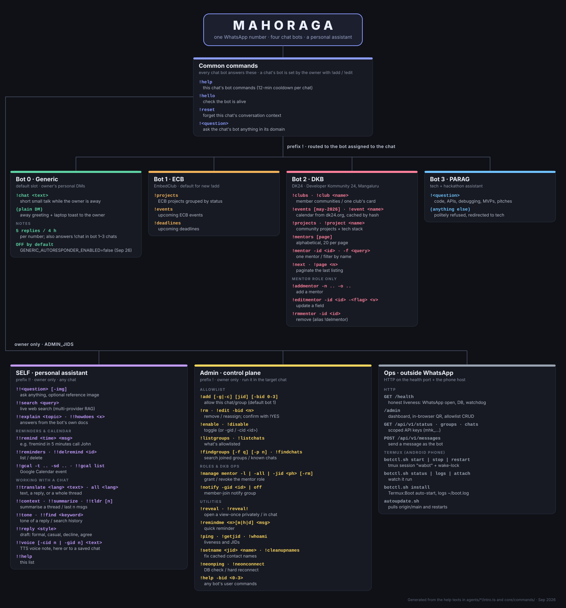

# Building MAHORAGA: four months, 415 commits, one WhatsApp number

MAHORAGA is a WhatsApp bot. One phone number runs four chat bots, a personal assistant that only its owner can use, and a small HTTP control plane. This post tells how it got there, using nothing but the git history: from a single 618-line `bot.js` on 18 May 2026 to the TypeScript codebase of about 16k lines that runs on an Android phone today.



---

## The shape of the history

| | |
|---|---|
| First commit | 18 May 2026 |
| Latest commit | 27 Sep 2026 |
| Commits | 415 (365 excluding the 50 `activity update` commits) |
| Merged pull requests | 46 |
| Busiest day | 31 May: 101 commits |

The work came in bursts, not a steady stream:

```
May 18 ▏██████                          first commit, JS → TS, Render
May 22 ▏████████████████████████████    DKB bot, Neon, mentor directory
May 24 ▏██████████████████████████████████████████████ the big modular split
May 26-27 ████████████████████████      the 408 disconnect war
May 31 ▏█████████████████████████████████████████████████████████████████████████████████████████████████████ (101)
Jun 07 ▏██████████████████████████████████████████████████ (green_dots.txt, see below)
Jul 04 ▏███████████████████████████████████████████████    audit follow-up, PRs #1–#9
Jul 05-08 ██████████████████████████████████████████████    PATCHES Fix #1 and #2
   … two quiet months …
Sep 20-22 ██████████████                                    MAHORAGA: dashboard, API, watchdog
Sep 26-27 ███████████████                                   moves onto a phone
```

---

## Chapter 1 — A bot with an allowlist (18 May)

The first commit, `feat: WhatsApp bot allowlist, admin controls, and deploy setup`, is one `bot.js` file with two config modules: `chatConfig.js` and `groupConfig.js`. It used [Baileys](https://github.com/WhiskeySockets/Baileys) (`7.0.0-rc11`) from day one. Baileys speaks WhatsApp's multi-device protocol directly instead of driving a browser. The core idea is still in the code today: **the bot says nothing unless the owner has allowlisted the chat or group.**

The same day, the project went through three deployment ideas: a Render background worker, then a Render web service with a health endpoint (Render's free tier wants something listening on a port), and then a commit titled simply:

> Transition to TS / Multi Bot / Remove from list

That commit set the course for everything after it. The project moved to TypeScript, and one number would host *several* bots, each chat assigned to one of them.

## Chapter 2 — DKB and the DK24 community (22–23 May)

The first real bot was **DKB**, an assistant for DK24 (Developer Kommunity 24), a network of college tech communities in Mangaluru. On 22 May it gained:

- a mentor directory in Postgres (Neon) with flag-based `!addmentor` / `!editmentor` and phone country-code prompting,
- club and event lookups, first scraped from the DK24 site with Puppeteer and cached,
- a long system prompt covering DK24's history, its umbrella-network model, its pillars and the TEAM (Techie/Explorer/Advisor/Mentor) growth model,
- a rule for ambiguous questions: if "devfest" matches several events, *ask which one* instead of guessing.

This was also the first run-in with WhatsApp's formatting: an ASCII-art header broke compilation and then had to be wrapped in backticks to render as monospace.

On 23 May a joke bot, **Sajige Bajil** ("Bot 3 (TEMP)"), showed up for banter and translation. It was removed two days later. The same day also brought the first move away from a monolith: *"decouple monolith agents and centralize logging, rate limits, and prompt security."*

## Chapter 3 — The great split and the LID problem (24 May)

On 24 May there were 46 commits, and most of them were one refactor. The single `dk24Store` and the monolithic community, event and mentor services were split into:

- `storage/` repositories (events, community, mentors, RBAC, audit logs, allowlists, cache),
- `services/` on top of them,
- a Redis client and **Redis-backed distributed state**, rate limiting and idempotency checks,
- an **LLM-based prompt-injection classifier** and CDATA wrapping of all dynamic context, so data stuffed into the prompt is never read as instructions.

The same day went into a WhatsApp detail that anyone building on Baileys runs into: **LIDs**. WhatsApp increasingly identifies group participants by an opaque "linked ID" instead of their phone number. Six commits in a row deal with it: lookup through Baileys' `signalRepository`, a fallback to group metadata, and finally a *persistent LID→phone mapping in the database*. Without that mapping, role checks such as "is this person a mentor?" could not work.

## Chapter 4 — The 408 war (26–27 May)

With the WhatsApp session keys stored in Neon, the bot started falling into a **408 disconnect loop**. The commit log from those two days reads like a debugging diary:

1. warm the Neon pool before the WhatsApp handshake
2. replace parallel key writes with one bulk `UPSERT`
3. raise the pool idle timeout to 120 s to survive the QR scan
4. exponential backoff + a crash-loop breaker
5. TCP keepalive + a 45 s heartbeat so Neon doesn't suspend
6. dedicated auth pool… persistent singleton… don't close it on reconnect…
7. **`revert: rollback to pre-security state entirely to restore working connection`**

The revert's message is honest: *"This guarantees a working connection while we regroup."* Encryption came back the same day, this time with a plaintext-to-encrypted migration path. That pattern shows up again and again in this repo: roll back to something that works, then rebuild carefully.

The same stretch brought the admin allowlist controller and the first version of **`!reveal`**, which reads view-once media (the bot receives the media keys, so it can decrypt it). There was also contact-name caching, because a list of raw JIDs is useless to a person reading it.

## Chapter 5 — The marathon (31 May)

31 May has **101 commits**, the single largest day in the repo. In order, roughly:

- **Architecture.** `adminController` split into `admin/{allowlist,rbac,utility}`, a command registry with RBAC middleware, and the message router broken into middleware (`lidResolver`, `antiReplay`, `introDetector`).
- **A common interface.** A `BotHandler` interface and `BotContext`, with PARAG, ECB and DKB migrated onto it. `!help` became dynamic, built from the registry instead of hardcoded text.
- **New bots.** **ECB** (EmbedClub) got its foundation, and **SELF**, the owner-only assistant on the `!!` prefix, arrived with reminders, translation, thread context, voice notes (Groq Orpheus TTS with a daily cap) and web search.
- **Search.** Firecrawl and Tavily providers, a keyword reranker with no ML model, and a context builder for the LLM.
- **Hardening.** A global per-user hourly rate limit, an upgrade to `llama-prompt-guard-2-86m` for the injection classifier, and an 8 s timeout around prompt building.
- **Tests.** The first vitest suites: puppeteer queue, typing delay, anti-replay, time parser, rate limits, firewall, RBAC and the command registry.
- **Deploy pain.** Puppeteer's Chrome download fought Nixpacks. The fix went from system chromium, to an explicit `executablePath`, to a Dockerfile that caches the Chromium layer, to `libasound2t64` → `libasound2` for Debian bookworm.

## An aside: `green_dots.txt`

On 7 June the history has **50 commits** named `chore: activity update N (xxxx)`. Each one adds a single line to `green_dots.txt`. They don't touch the bot. They fill in the GitHub contribution graph. Two `chore: keep-alive commit` entries on 10 and 11 July do the same job. They're left out of the counts above, and they're mentioned here only so the numbers add up.

## Chapter 6 — Audit follow-up (4 July)

After a quiet June, 4 July opened with a security fix (**Baileys rc11 → rc13 for CVE-2026-48063**), followed by a batch of audit items:

- per-message failure isolation in the router,
- a global outgoing-message cap and differentiated reconnect backoff (to keep the number from getting banned),
- **fail closed** if the auth-state encryption key is missing,
- removal of the firewall's keyword bypass, plus an **outbound secret scrubber**,
- `dk24.org/api/v1/projects` integration, with Puppeteer removed entirely.

This is also when the project started using pull requests (PRs #1–#9). It shows in the commit messages, which switched to conventional-commit style with scopes. The bot line-up changed too: a new **Generic** bot took slot 0 as the default, and PARAG moved to slot 3. Commands were made consistent across bots: `-gid`/`-cid` targeting, shared pagination, `-id` detail views, and a `!help` scoped to the chat's own bot with a cooldown and role gating. SELF got `!!gcal` (Google Calendar) and `-img` reference images.

## Chapter 7 — Agentic search and PATCHES (5–8 July)

On 5 July the search pipeline became an **agentic tool loop** that is allowed to *abstain*. A few hours later it was rewritten again as a multi-provider fan-out with the per-domain APIs removed. Then came two rounds of fixes tracked in `PATCHES.md`:

- **Fix #1:** lock down probe commands, a restricted **offline auto-responder** for the owner's personal DMs, and `!add`/`!rm -g|-c` unified.
- **Fix #2:** `!chat` as the explicit way to talk to the auto-responder, a 5-replies-per-4-hours budget, allowlist commands that infer their target from the chat they're sent in, and a `!manage mentor` rewrite for bulk grants.

Out of this came a side project, **`laptop-notifier/`**: a desktop toast when the auto-responder answers someone. It first ran through Redis pub/sub over an SSH tunnel, then connected directly to Upstash. It also answered "is the owner actually at their desk?", and that took five PRs in one evening (#26–#30). They move from "any window naming WhatsApp", to the real WhatsApp app, to the `(N) WhatsApp` unread-badge title, to a strict WhatsApp Web match.

## Chapter 8 — MAHORAGA (20–22 September)

After two months of silence, PR #34 renamed the project to **MAHORAGA** and turned it into something you can operate:

- a **watchdog** and an honest `/health` that returns 503 when WhatsApp is actually down,
- an **admin dashboard** that shows the pairing QR code in the browser, so there's no more squinting at a terminal,
- a **public REST API** (`/api/v1/status|groups|chats|messages`) with scoped `mhk_` API keys,
- allowlist CRUD over HTTP and a Groq model check.

View-once got another pass as well: an Android-companion identity so view-once media is delivered to the bot at all, correct detection, and Baileys rc14.

## Chapter 9 — Living on a phone (26–27 September)

The last chapter moved the bot off Render and **onto an Android phone**: Termux, Debian under `proot-distro`, a supervisor script standing in for Render's restarts, `botctl.sh` for start/stop/logs in tmux, a Termux:Boot entry, and a shim, because `os.networkInterfaces()` throws under proot on Android 11+. The owner-away auto-responder was switched **off by default** (`GENERIC_AUTORESPONDER_ENABLED=false`), pending optimisation.

A phone on mobile data is a slower, less reliable link than a data centre, and the final commits deal with that:

- `feat(termux): auto-update from origin/main`
- `feat(dk24): fetch full calendar once, cache by content hash`
- `fix: Neon connect fails from slow links; log the real cause`
- `fix(db): drop racy SET statement_timeout; use pg query_timeout`
- `fix(termux): find Debian under both proot-distro layouts`
- `fix(termux): boot script logs to ~/boot.log`

The most recent commit, `docs(help): make every help text match the commands that exist`, made the help texts accurate enough that the command map at the top of this post could be drawn straight from them.

---

## Where it stands

| | May 18 | Sep 27 |
|---|---|---|
| Language | JavaScript, one 618-line file | TypeScript, ~16k lines |
| Bots | 1 | Generic, ECB, DKB, PARAG + SELF |
| Storage | JSON config | Postgres (Neon) + Redis |
| Security | allowlist | allowlist, RBAC, prompt firewall, rate limits, secret scrubber, encrypted session |
| Ops | `console.log` | `/health`, watchdog, dashboard, REST API |
| Host | Render | an Android phone |
| Tests | none | 32 unit test files |

Things the history suggests are next: the auto-responder is waiting on its "pending optimisation", `knowledge/` has been reserved since 31 May for document ingestion, and `docs/roadmap-2026-07.md` lists items it deliberately deferred.
